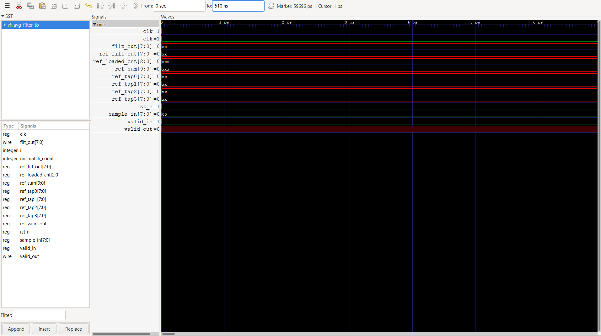

# Parameterized Synchronous FIFO (Verilog)

## Overview

This project implements a parameterized Synchronous FIFO (First-In First-Out) in Verilog HDL. The FIFO supports configurable data width and depth while providing full and empty status flags to prevent overflow and underflow conditions. A comprehensive testbench is included to verify the functionality under different operating scenarios.

---

## Features

- Parameterized data width and FIFO depth
- Single-clock synchronous operation
- Independent read and write enable signals
- Simultaneous read and write support
- Full and empty flag generation
- Occupancy tracking using a counter
- Synthesizable RTL design
- Functional verification using a Verilog testbench

---

## Project Structure

```
sync_fifo/
│── sync_fifo.v          // RTL Design
│── sync_fifo_tb.v       // Testbench
│── waveform.png         // Simulation Waveform
└── README.md
```

---

## Parameters

| Parameter | Description | Default |
|-----------|-------------|---------|
| DATA_WIDTH | Width of each data word | 8 |
| DEPTH | Number of FIFO locations | 8 |
| ADDR_WIDTH | Address width (`$clog2(DEPTH)`) | Auto |

---

## Module Interface

### Inputs

| Signal | Width | Description |
|--------|-------|-------------|
| clk | 1 | System clock |
| rst | 1 | Synchronous reset |
| wr_en | 1 | Write enable |
| rd_en | 1 | Read enable |
| din | DATA_WIDTH | Input data |

### Outputs

| Signal | Width | Description |
|--------|-------|-------------|
| dout | DATA_WIDTH | Output data |
| full | 1 | FIFO Full flag |
| empty | 1 | FIFO Empty flag |

---

## Block Diagram

```text
                           +----------------------------------+
                           |      Synchronous FIFO            |
                           |                                  |
      din ---------------->|                                  |
      wr_en -------------->|                                  |
      rd_en -------------->|                                  |-------> dout
      clk ---------------->|                                  |
      rst ---------------->|                                  |
                           |                                  |
                           |     +----------------------+     |
                           |     |     FIFO Memory      |     |
                           |     +----------------------+     |
                           |         ▲              ▲         |
                           |         |              |         |
                           |     Write Ptr      Read Ptr      |
                           |         │              │         |
                           |         └──────┬───────┘         |
                           |                │                 |
                           |         Occupancy Counter        |
                           |                │                 |
                           |        ┌───────┴────────┐        |
                           |        │                │        |
                           |     Full Flag      Empty Flag    |
                           +----------------------------------+
```

---

## Working Principle

### Write Operation

- When `wr_en` is asserted and the FIFO is not full, the input data is written into the FIFO memory.
- The write pointer advances to the next memory location.
- The occupancy counter is incremented.

### Read Operation

- When `rd_en` is asserted and the FIFO is not empty, data is read from the FIFO memory.
- The read pointer advances to the next memory location.
- The occupancy counter is decremented.

### Simultaneous Read and Write

When both `wr_en` and `rd_en` are asserted:

- One data word is written into the FIFO.
- One data word is read from the FIFO.
- The occupancy count remains unchanged.

### Full Condition

The `full` flag is asserted when all FIFO locations are occupied.

### Empty Condition

The `empty` flag is asserted when the FIFO contains no valid data.

---

## Testbench Verification

The testbench verifies the following scenarios:

- Reset operation
- Multiple write operations
- Multiple read operations
- Simultaneous read and write
- FIFO full condition
- FIFO empty condition

---

## Simulation Result

Add the GTKWave waveform screenshot below.

```markdown

```

---

## Tools Used

- Verilog HDL
- Icarus Verilog
- GTKWave
- Visual Studio Code

---

## Concepts Practiced

- Parameterized RTL Design
- FIFO Architecture
- Sequential Logic Design
- Memory Arrays
- Pointer Management
- Occupancy Counter Design
- Full and Empty Flag Generation
- RTL Simulation
- Verilog Testbench Development

---

## Future Improvements

- Circular pointer implementation
- Almost Full and Almost Empty flags
- Overflow and Underflow detection
- First Word Fall Through (FWFT) FIFO
- SystemVerilog Assertions (SVA)
- Self-checking testbench
- Constrained-random verification

---

## License

This project is intended for educational and learning purposes.
